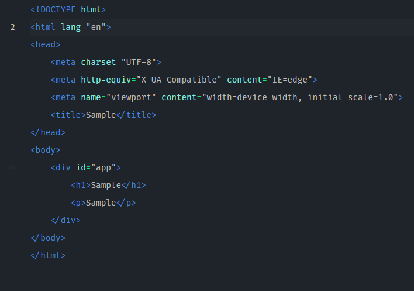
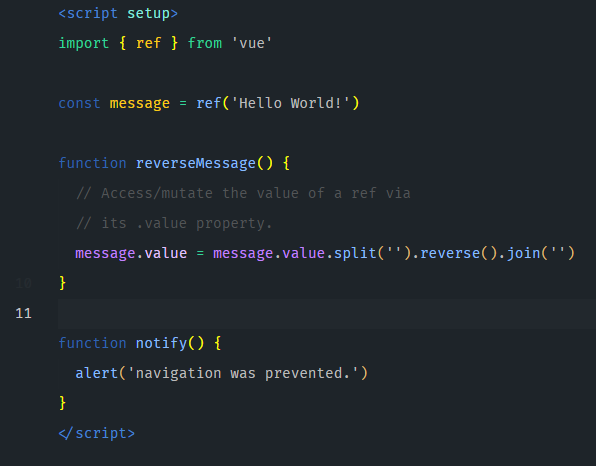
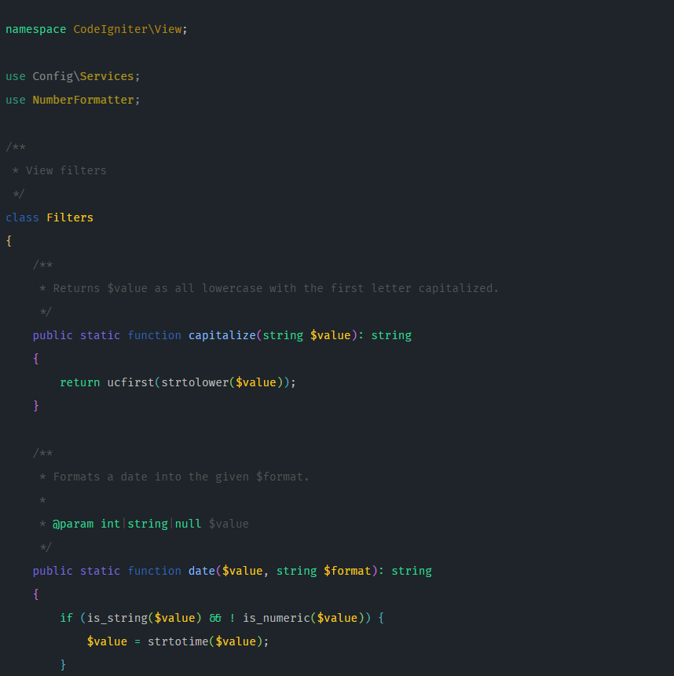

<h1 align="center">Jameel Dark Theme</h1>

  

 
Jameel (meaning beautiful in Arabic) is a dark theme with crisp colors and a good contrast ratio.

 
 

## Samples:
### HMTL

### vue

### PHP

### JS

